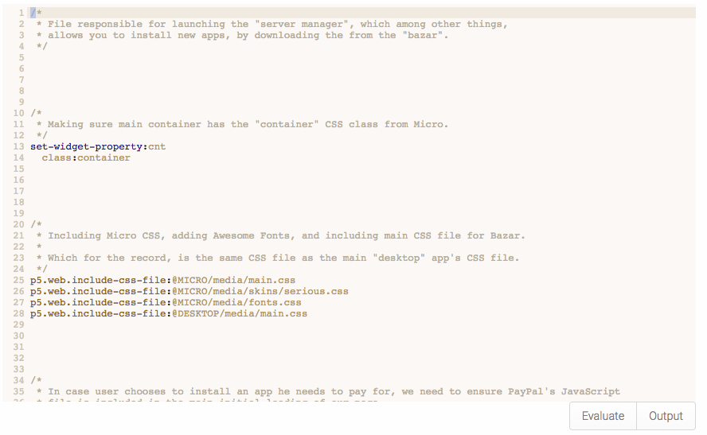

# Hypereval - An "IDE" module for Phosphorus Five

Hypereval allows you to evaluate Hyperlambda from within your browser, having it executed
on the server. It also allows you to create Hyperlambda pages, and startup objects, arguably
giving you an environment for creating your apps, having its Hypereval snippets becoming both 
the Controllers and its Views. Pages would be the equivalent of a _"Views"_ and startup objects, 
and/or other snippets would become the equivalent of your _"Controllers"_.

In addition to the above, it also features an _"immediate mode"_, allowing you to evaluate your
snippets immediately, optionally seeing the results of your evaluation in an _"output"_ window.

The snippets it creates are stored in a MySQL database, and Hypereval features a rich _"API"_
for retrieving snippets, evaluating them, creating snippets, etc. See the list of Active Events
below.

* __[hypereval.snippets.create]__ - Creates a new snippet. Pass in [content] as Hyperlambda, and [_arg] as snippet name. Notice, will overwrite existing snippets with the same name.
* __[hypereval.snippets.delete]__ - Deletes the given [_arg] snippet.
* __[hypereval.snippets.evaluate]__ - Evaluates the given [_arg] snippet, with the given arguments, returning whatever results are created.
* __[hypereval.snippets.get]__ - Returns the given [_arg] snippet.
* __[hypereval.snippets.search]__ - Searches for snippets matching the given [_arg] value.

In addition, Hypereval creates two extension widgets, which you can use in your own apps.

* __[hypereval.widgets.eval]__ - The entire Hypereval module, more or less. Useful to inject on pages during debugging and similar sessions.
* __[hypereval.widgets.hyperlambda-textarea]__ - A Hyperlambda _"textbox"_, using CodeMirror behind, to feature intellisense, autocomplete, etc.

The Hyperlambda editor, or its _"code textarea"_ is based upon CodeMirror, giving you an extremely rich code editor, for editing Hyperlambda.
Including for instance intellisense, autocomplete, etc, etc, etc.
