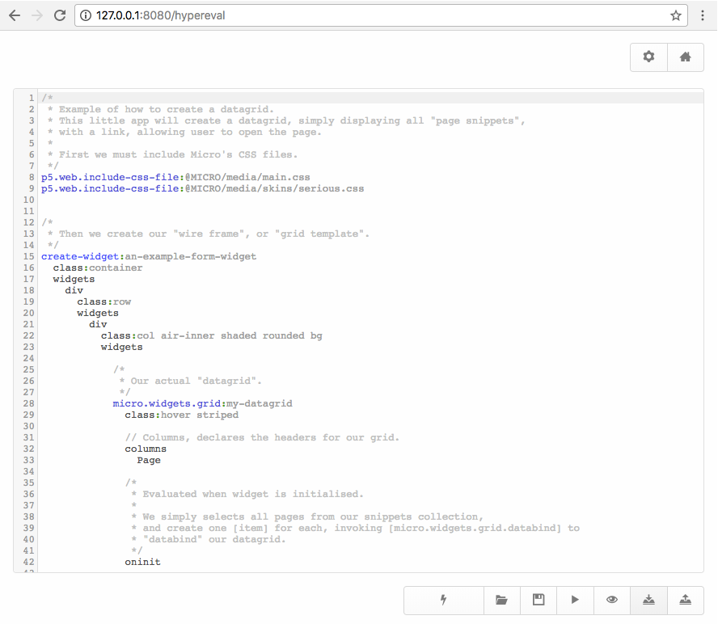
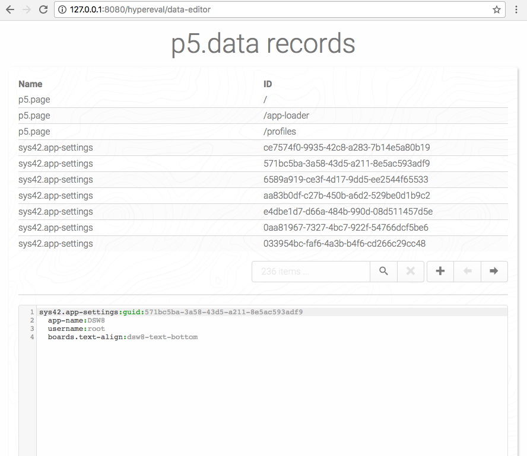
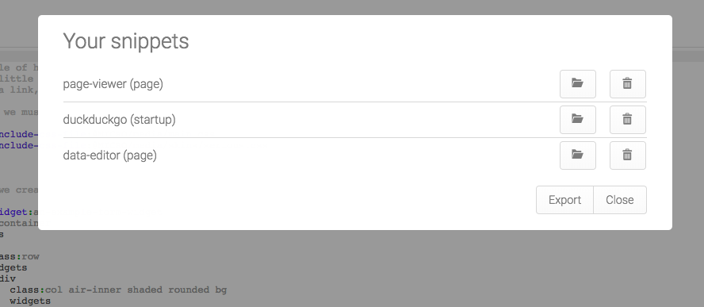

# Hypereval - Evaluate Hyperlambda snippets

Hypereval allows you to evaluate Hyperlambda from within your browser, having it executed
on the server. It also allows you to create Hyperlambda pages, and startup objects, arguably
giving you an environment for creating your apps, having its Hypereval snippets becoming both 
its Controllers and its Views. Pages would be the equivalent of _"Views"_ - While startup objects, 
and/or other snippets, would become the equivalent of your _"Controllers"_.

In addition to the above, it also features an _"immediate mode"_, allowing you to evaluate your
snippets immediately, optionally seeing the results of your evaluation in an _"output"_ window.

The snippets it creates are stored in a MySQL database, and Hypereval features a rich _"API"_
for retrieving snippets, evaluating them, creating snippets, etc. See the list of Active Events
below.

* __[hypereval.snippets.load]__ - Returns the given [_arg] snippet's Hyperlambda code.
* __[hypereval.snippets.save]__ - Creates or updates a snippet. Pass in [content] as Hyperlambda, and [_arg] as snippet name.
* __[hypereval.snippets.delete]__ - Deletes the given [_arg] snippet. Pass in snippet's name as [_arg].
* __[hypereval.snippets.evaluate]__ - Evaluates the given [_arg] snippet, with the given arguments, returning the results of the evaluation.
* __[hypereval.snippets.search]__ - Searches for snippets matching the given [_arg] value.

In addition, Hypereval creates two extension widgets, which you can use in your own apps.

* __[hypereval.widgets.eval]__ - The entire Hypereval module as an extension widget, more or less. Useful to inject on pages during debugging sessions for instance.
* __[micro.widgets.codemirror]__ - A Hyperlambda _"textbox"_, using CodeMirror behind to feature intellisense, autocomplete, etc. Highly useful for editing Hyperlambda.

The Hyperlambda editor, or its _"code textarea"_ is based upon CodeMirror, giving you an extremely rich code editor for editing Hyperlambda -
Including for instance intellisense, autocomplete, syntax error feedback, etc, etc, etc.

Hypereval is extremely powerful, and arguably an entire IDE, which you can run through your browser. Below is a screenshot of one of its default
snippets, which is created as you install Hypereval. The snippet below creates a _"page"_ object, which allows you to edit your p5.data records,
arguably being the _"DBMS"_ for p5.data.

## Import/export snippets

You can also import snippets, either by dragging or dropping them directly unto the surface of your browser window, or by clicking the 
upload snippet button. You can also export snippets. In addition, you can export all your snippets, and import a range of snippets, as a zip
file, using similar logic. Below is a screenshot showing you the _"Load snippet window"_, which allows you to load a snippet from your snippet
collection.

Hypereval also creates a _"friendly URL"_ for all your snippets that are saved as _"page types"_, allowing you to literally create your apps,
as a bunch of loosely coupled snippets, being composed of extension widgets as startup snippets, pages as _"views"_ and startup snippets/plain snippets
as your controllers. For instance, from the above screenshot, to access the _"page-viewer"_ page snippet, you'd access it through a URL
such as `your-domain.com/hypereval/page-viewer`, while the data-viewer snippet can be found at `your-comain.som/hypereval/data-viewer`.

## Installation

The easiest way to install it, is to [install phosphorus five](https://github.com/polterguy/phosphorusfive),
for then to visit _"The Bazar"_, and simply install it through the Bazar on your local machine/server.
However, if you want a more manual installation path, you can download the latest release,
unzip it, and move the unzipped root folder into your _"core/p5.webapp/modules"_ folder. If you
choose this path, you should rename the folder, removing any version information, making sure
your module folder is called exactly _"hypereval"_. Installation through the Bazar
also requires you having some sort of GnuPG client on your machine/server. If you don't want
to fiddle with installing GnuPG, you can resort to download the latest zip file release directly.
